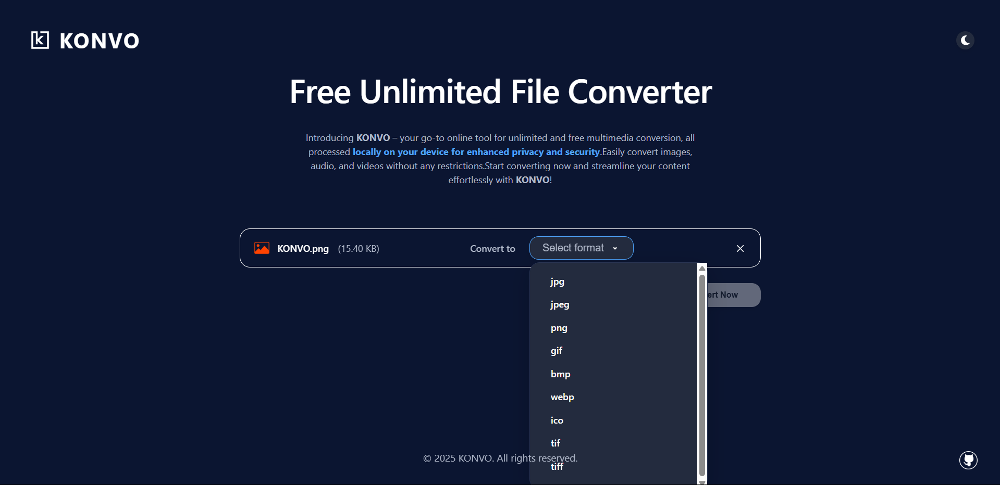

# KONVO - Universal File Converter
aa

*Main interface of the KONVO Universal File Converter app*


*Conversion interface with format selection*

A modern, privacy-focused multimedia conversion tool built with React, TypeScript, and Vite. Convert images, audio, and video files locally on your device—no uploads, no privacy risks.

## ✨ Features

- **Universal Conversion**: Convert images, audio, and video files between popular formats
- **Local Processing**: All conversions happen locally in your browser for maximum privacy
- **Supported Formats**:
  - **Images**: JPG, JPEG, PNG, GIF, BMP, WebP, ICO, TIF, TIFF
  - **Audio**: MP3, WAV, OGG, AAC, WMA, FLAC, M4A
  - **Video**: MP4, M4V, WEBM, OGV, MKV, AVI, MOV, FLV, H264, 264
- **Extract Audio from Video**: Convert video files to audio formats
- **Dark/Light Theme**: Beautiful theme switching with animated transitions
- **Drag & Drop**: Intuitive file upload interface
- **Responsive Design**: Works perfectly on desktop and mobile
- **Type Safety**: Built with TypeScript for robust development
- **Modern UI/UX**: Smooth animations, accessible controls, and a clean interface

## 🚀 Getting Started

### Prerequisites

- Node.js (v16 or higher)
- npm or yarn

### Installation

1. Clone the repository:
```bash
git clone <repository-url>
cd konvo
```

2. Install dependencies:
```bash
npm install
```

3. Start the development server:
```bash
npm run dev
```

4. Open your browser and navigate to `http://localhost:3000`

## 📁 Project Structure

```
src/
├── components/          # Reusable UI components
│   ├── Header/         # Application header with theme toggle
│   ├── FileUpload/     # File upload and drag-drop interface
│   ├── FileConverter/  # Image conversion interface
│   ├── AudioConverter/ # Audio conversion interface
│   ├── VideoConverter/ # Video conversion interface
│   └── SplashAnimation/# Theme transition animation
├── hooks/              # Custom React hooks
│   └── useTheme.ts     # Theme management hook
├── utils/              # Utility functions
│   └── fileUtils.ts    # File handling utilities
├── types/              # TypeScript type definitions
│   └── index.ts        # Application types
├── constants/          # Application constants
│   └── index.ts        # Theme, formats, and configuration
├── App.tsx             # Main application component
├── main.tsx            # Application entry point
├── index.css           # Global styles
```

## 🛠️ Development

### Available Scripts

- `npm run dev` - Start development server
- `npm run build` - Build for production
- `npm run preview` - Preview production build
- `npm run lint` - Run ESLint
- `npm run lint:fix` - Fix ESLint errors
- `npm run format` - Format code with Prettier
- `npm run type-check` - Run TypeScript type checking

### Code Quality

This project follows strict coding standards:

- **TypeScript**: Full type safety with strict configuration
- **ESLint**: Code linting with React and TypeScript rules
- **Prettier**: Consistent code formatting
- **Component Structure**: Modular, reusable components
- **CSS Architecture**: BEM methodology for CSS classes
- **Error Handling**: Comprehensive error handling and validation

### Best Practices Implemented

1. **Component Architecture**
   - Single Responsibility Principle
   - Props interface definitions
   - Proper component composition

2. **State Management**
   - Custom hooks for reusable logic
   - Local state for component-specific data
   - Proper state updates and side effects

3. **Type Safety**
   - Strict TypeScript configuration
   - Interface definitions for all data structures
   - Proper type annotations

4. **Performance**
   - React.memo for expensive components
   - Proper dependency arrays in useEffect
   - Optimized re-renders

5. **Accessibility**
   - ARIA labels and roles
   - Keyboard navigation support
   - Screen reader compatibility

6. **Error Handling**
   - File validation
   - Conversion error handling
   - User-friendly error messages

7. **Responsive Design**
   - Mobile-first approach
   - Breakpoint-based styling
   - Flexible layouts

## 🎨 Styling

The project uses a combination of:
- **CSS Modules**: Component-scoped styles
- **BEM Methodology**: Consistent class naming
- **CSS Custom Properties**: Theme variables
- **Responsive Design**: Mobile-first approach

## 🔧 Configuration

### TypeScript
- Strict mode enabled
- Path mapping for clean imports
- Proper module resolution

### ESLint
- React and TypeScript rules
- Prettier integration
- Custom rule configurations

### Vite
- Fast development server
- Optimized production builds
- Plugin configuration


### Development Guidelines

- Follow the existing code style
- Add TypeScript types for new features
- Write meaningful commit messages
- Test your changes thoroughly
- Update documentation as needed

## 📄 License

This project is licensed under the MIT License - see the [LICENSE](LICENSE) file for details.


